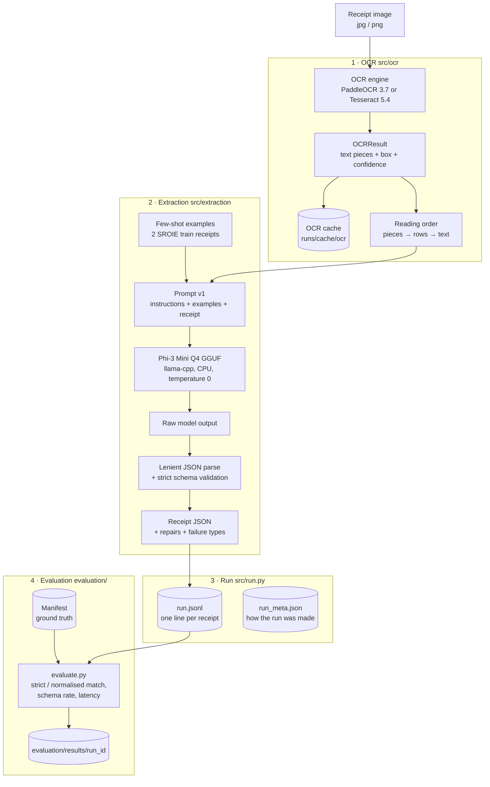

# Architecture

How a receipt image becomes validated JSON and a score, and why the pipeline
is built this way. This describes the system **as built** at the end of M2.
The original proposal design is [design-diagram.svg](design-diagram.svg); see
[§9](#9-differences-from-the-proposal-design) for how the two differ.

## 1. Overview

The pipeline extracts four fields (**company, date, address, total**) from
receipt images. The constraints:

- **Fully local and CPU-only.** No cloud API and no GPU, so no document ever
  leaves the machine (the GDPR motivation). Everything runs on a Windows
  laptop: Intel 4 cores / 8 threads, Python 3.12.
- **Small quantized LLM:** Phi-3-mini-4k-instruct, 4-bit GGUF, via
  llama-cpp-python.
- **Built to measure failure, not just success.** Every stage keeps what the
  next stage needs to explain a wrong answer: OCR boxes and confidences, the
  exact prompt, the raw model output, parse repairs and failure types.

## 2. Data flow



**One command** runs stages 1–3, for one image or a whole manifest:

```bash
python -m src.run evaluation/datasets/SROIE/raw/test/X00016469670.jpg
python -m src.run --manifest evaluation/datasets/SROIE/subset_test_50.jsonl --engine all
python evaluation/evaluate.py runs/pipeline/<run_id> --manifest evaluation/datasets/SROIE/subset_test_50.jsonl
```

Before that, the datasets are converted once into manifests by
`evaluation/datasets/{SROIE,CORD}/prepare.py` (see [§7](#7-datasets)).

## 3. Components

| Component | Code | Input → Output | Notes |
|---|---|---|---|
| Dataset preparation | `evaluation/datasets/SROIE/prepare.py`, `evaluation/datasets/CORD/prepare.py` | raw release → `manifest.jsonl`, seeded subset, `prepare_report.json` | validates labels, finds duplicate images, normalises date/total |
| Normalisation | `evaluation/normalize.py` | a date or amount string → ISO date / 2-decimal amount | shared by preparation and evaluation; amount parsing depends on `locale` (`my` ringgit, `id` rupiah) |
| OCR interface | `src/ocr/base.py` | image path → `OCRResult` | engines are interchangeable; confidence always 0–1 |
| OCR engines | `src/ocr/paddle.py`, `src/ocr/tesseract.py` | image → text pieces | PaddleOCR: CPU, no confidence cutoff. Tesseract: `--psm 4`, grayscale |
| Reading order | `src/ocr/layout.py` | pieces → prompt text + row map | joins pieces on the same row (`TOTAL:` + `193.00`) |
| OCR run log / cache | `src/ocr/runlog.py` | `OCRResult` ↔ JSON | a cached result keeps the OCR time measured when it really ran |
| Schema | `src/extraction/schema.py` | JSON → `Receipt` | 4 required keys, `str` or `null`, no extra keys, strict types |
| Prompt | `src/extraction/prompts.py`, `fewshot.py` | OCR text → chat messages | version `v1`; few-shot examples from SROIE train only |
| LLM | `src/extraction/llm.py` | messages → `Generation` | llama-cpp; records token counts and prompt/generation time |
| Parser | `src/extraction/parse.py` | raw text → `ParseOutcome` | lenient repairs + a failure type for every deviation |
| Runner | `src/run.py` | image or manifest → `run.jsonl` + `run_meta.json` | batch, resume, warm-up, keeps Windows awake |
| Evaluator | `evaluation/evaluate.py` | run log + manifest → `evaluation/results/<run_id>/` | every manifest receipt counts; failed output = wrong |
| Environment check | `scripts/check_env.py` | – | imports, OCR on one receipt with both engines, one generation |

Heavy libraries (PaddleOCR, llama-cpp, Tesseract) are imported only when an
engine or the model is actually used. The test suite runs without them (see
the README, "Run the tests").

## 4. Walkthrough: one receipt end to end

SROIE test receipt `X00016469670`, PaddleOCR, 2-shot.

**1. OCR.** PaddleOCR returns 45 text **pieces**, each with a box and
confidence. A printed row is often split in two:

```text
index  confidence  box (x1,y1,x2,y2)     text
   36       1.000  (171, 696, 240, 718)  TOTAL:
   37       1.000  (288, 697, 358, 719)  193.00
   40       0.767  (92, 749, 231, 769)   xxxxx000000x4318
```

**2. Reading order.** Pieces that overlap vertically are joined left to
right, which gives 29 rows. The prompt text now contains `TOTAL: 193.00` on
one line. The row map `[..., [36, 37], ...]` records which pieces each line
came from.

**3. Prompt.** Five chat messages:
- **Message 1 (user):** the instructions ("return only one JSON object
  with exactly these keys… copy each value exactly… use null…") followed
  by example receipt 1's OCR text. The instructions go here because Phi-3's
  chat template **silently drops `system` messages**.
- **Messages 2–4:** alternate between example answers (assistant, JSON) and
  example receipt 2 (user).
- **Message 5 (user):** this receipt's OCR text.

The example part is identical for every receipt, so within a batch llama.cpp
reads it only once.

**4. Model.** Phi-3 generates greedily (temperature 0):

```text
 {"company": "OJC MARKETING SDN BHD", "date": "15/01/2019", "address": "NO 2 & 4, JALAN BAYU 4, BANDAR SERI ALAM, 81750 MASAI, JOHOR", "total": "193.00"}
```

That was 1589 prompt tokens and 86 generated tokens.

**5. Parse and validate.** The output is valid JSON as-is, needs no
repairs, and fits the strict schema, so `strict_valid = true` and there are
no failures. If the model had wrapped the JSON in ```` ``` ````, added a
sentence, returned `"total": 193.0` or stopped mid-object, the parser would
record `code_fence`, `extra_text`, `wrong_type` or `truncated`.

**6. Run log.** One line is appended to `runs/pipeline/<run_id>/run.jsonl`
with the OCR output, raw model output, parse outcome and timings (§5).

**7. Evaluation.** Against the manifest label:

| Field | Label | Strict | Normalised | In OCR text |
|---|---|---|---|---|
| company | `OJC MARKETING SDN BHD` | ✓ | ✓ | ✓ |
| date | `15/01/2019` | ✓ | ✓ (2019-01-15) | ✓ |
| address | `…BANDAR SERI ALAM, B1750 MASAI, JOHOR` | ✗ | ✗ | ✗ |
| total | `193.00` | ✓ | ✓ | ✓ |

The address "error" is a **label typo** (`B1750` for the postcode
`81750`). The model is right. Cases like this are why the evaluator also
reports whether the gold value appears in the OCR text at all.

## 5. Data formats

All paths are relative to the repo root. Files under `runs/` and anything
containing ground-truth text are gitignored (see [§8](#8-reproducibility)).

**Manifest line** (`evaluation/datasets/<DS>/manifest.jsonl`, and the
`subset_*.jsonl` files):

```json
{"id": "X51005230605", "split": "test", "image": "evaluation/datasets/SROIE/raw/test/X51005230605.jpg",
 "sha256": "…", "duplicate_of": null, "issues": [],
 "ground_truth": {"raw": {"company": "…", "date": "01/02/2018", "address": "…", "total": "4.90"},
                  "normalized": {"date": "2018-02-01", "total": "4.90"}}}
```

CORD records also have:
- `"locale": "id"`
- `"fields_available": ["total"]`
- `ground_truth.line_items` (menu items)

`company`, `date` and `address` are `null` on CORD because they aren't
annotated.

**Run log line** (`runs/pipeline/<run_id>/run.jsonl`): one per receipt and
engine, appended as soon as the receipt finishes:

| Key | Contents |
|---|---|
| `run_id`, `receipt_id`, `split`, `engine`, `image` | identification |
| `ocr` | `text` (reading order), `rows` (row map), `lines` (every piece: `index`, `text`, `box`, `polygon`, `confidence`, `angle`, `words`), `image_size`, `engine_version` |
| `ocr_cached` | whether the OCR came from the cache (its `ocr_s` is the time measured when it really ran) |
| `llm` | `raw_output`, `finish_reason`, `prompt_tokens`, `prompt_tokens_evaluated` (after prefix reuse), `completion_tokens`, `seconds`, `prompt_eval_s`, `gen_s` |
| `outcome` | `parsed`, `repairs`, `failures` (`[{type, field, detail}]`), `schema_valid`, `strict_valid`, `lenient` (best usable values) |
| `timings` | `ocr_s`, `llm_s`, `llm_prompt_s`, `llm_gen_s`, `parse_s`, `total_s` (= OCR + LLM + parse), `wall_s` |
| `error` | `{stage, type, message}` if the receipt crashed, else `null`; the batch continues |
| `power` | `{source: ac / battery, battery_percent}` (laptops throttle on battery) |

Failure types in `outcome.failures`: `prompt_too_long`, `truncated`,
`no_json`, `invalid_json`, `not_object`, `missing_field`, `null_field`,
`wrong_type`, `extra_field`.

**Run metadata** (`runs/pipeline/<run_id>/run_meta.json`):
- the command, manifest path and SHA-256
- the git commit and any uncommitted files
- library versions, CPU and power state at start
- prompt version, shots and few-shot seed
- per engine: OCR settings, few-shot IDs, **the exact prompt prefix**, and
  the warm-up time
- LLM settings and model file size
- a summary: validity counts, failure/repair counts, mean/median timings

**OCR run log** (`runs/cache/ocr/<engine>/<receipt>.<engine>.json`): the
full `OCRResult` plus the reading order. The cache reuses it only while the
engine settings are unchanged.

**Evaluation results** (`evaluation/results/<run_id>/`):
- `summary.json`: metrics per engine and field. Committed.
- `per_receipt.csv`: flags and timings, no text. Committed.
- `per_receipt_detail.jsonl`: predictions and labels. Gitignored.

## 6. Design decisions

### Why PaddleOCR (and Tesseract)

- **Accuracy on receipts.** PaddleOCR (PP-OCR detection + recognition) read
  the gold total on 96 % of the SROIE subset, against 80 % for Tesseract. On
  CORD's phone photos it was 96 % against 34 %.
- **It returns what the failure analysis needs:** a box and a confidence
  per piece. `text_rec_score_thresh=0` so that no low-confidence text is
  silently dropped.
- **It runs on CPU, locally, open-source (Apache 2.0).** `enable_mkldnn=False`
  avoids a oneDNN crash in Paddle 3.x on Windows.
- **The cost is speed:** a median of 74 s OCR per SROIE page on this CPU,
  and 4–5 minutes for the 35-megapixel scans.
- **Tesseract 5.4** is the second engine. It's a classic LSTM engine with
  its own layout analysis, about 70× faster, and a widely cited baseline. The
  pair shows how OCR quality drives extraction failures. Tesseract settings:
  `--psm 4` (single column of variable-size text) and grayscale input. Both
  were measured best of the tested options; upscaling made results worse.
- **TrOCR (in the original plan) was dropped:** it only reads single
  cropped text lines and would need a separate detector.

### Why Phi-3 Mini Q4

- **It fits the target hardware.** 3.8B parameters, 4-bit GGUF, 2.4 GB on
  disk. It runs in laptop RAM with a 4096-token context.
- **Speed on this CPU is usable:** ~14 prompt tokens/s and ~5 generated
  tokens/s. That's a median of ~44 s LLM time per receipt with prompt-prefix
  reuse.
- **It's instruction-tuned and MIT-licensed**, and follows the JSON format
  well: 96 % strict-valid outputs on SROIE.
- **The thesis studies small quantized models.** Their failure modes (e.g.
  derailment into unrelated text, copying few-shot answers) are the object
  of study, so a model at the small end is the point, not a compromise.
- **Mistral 7B** (in the proposal) would be roughly half as fast on this CPU
  and has not been evaluated yet.

### Other decisions

| Decision | Why |
|---|---|
| Temperature 0, fixed seed | Deterministic: a repeated run gave identical OCR text and raw output for all 100 receipt × engine runs |
| **No constrained decoding** (JSON grammar) | Forcing valid JSON would hide the format failures being measured |
| Instructions folded into the first user message | Phi-3's GGUF chat template drops `system` messages; with a system message the model got no instructions and wrote prose |
| 2 few-shot examples, SROIE train only, seed 42 | Enough to show the format. Train receipts identical to a test receipt are excluded. Examples come first so the prefix is reused. Each engine's examples use that engine's own OCR text |
| Rows rebuilt before prompting | OCR engines split rows into pieces; the prompt would otherwise separate labels from values |
| Lenient parsing, strict validation | `schema_valid` / `strict_valid` separate "usable" from "compliant"; `lenient` values allow field scoring despite small format slips |
| Locale-aware amount normalisation | `"60.000"` is 60.00 ringgit (SROIE) but 60,000 rupiah (CORD) |
| One JSONL line per receipt, written immediately | Crash-safe long runs (`--resume`); an error in one receipt doesn't stop the batch |
| Warm-up call per engine | Every page is timed with the model loaded and the prefix read, like a deployed system |
| Labels never committed | SROIE needs registration; manifests are regenerated in seconds; only IDs, reports and metrics without text are in git |

## 7. Datasets

Full details: [evaluation/datasets/README.md](../evaluation/datasets/README.md).

**SROIE** (ICDAR 2019, Task 3):
- Official release from the RRC portal, downloaded 2026-09-29. Each
  receipt is `<ID>.jpg` + `<ID>.txt` (JSON with the four fields).
- 626 train / 347 test pairs after ignoring **359 Windows numbered copies**
  (`X…(1).jpg`), all byte-identical to their base file.
- Label issues: 1 missing `address`, 1 empty `total` (both train).
- **Duplicate images under different IDs:** 5 groups in train, 3 in test.
  **7 test receipts are identical to train receipts**; they are excluded
  from the few-shot pool.
- 5 duplicate groups have **conflicting labels** (spacing, `SDN BHD` vs
  `SDN. BHD.`, `RM7.42` vs `7.42`).

**CORD v2:**
- `naver-clova-ix/cord-v2` from Hugging Face (CC BY 4.0), saved with
  `save_to_disk`, downloaded 2026-09-29. Read directly with `pyarrow`.
- 800 / 100 / 100 train / validation / test Indonesian receipts. Only
  `total.total_price` maps to the SROIE schema. Menu items are kept as
  `line_items`.
- Rupiah amounts use `.` and `,` as thousands separators (`60.000` =
  60000).
- `total_price` missing on 28 of 1000, given twice on 1, irregular grouping
  on 3.
- 2 duplicate image groups in train, none across splits.

**Evaluation subsets:**

| Subset | Drawn from | Rule | Seed | Eligible |
|---|---|---|---|---|
| `SROIE/subset_test_50` | SROIE test | no label issues, not a duplicate of a lower ID | 42 | 344 |
| `CORD/subset_valtest_50` | CORD validation + test | exactly one regular `total_price`, not a duplicate | 42 | 193 |

Few-shot examples are chosen separately: seed 42 from eligible SROIE
**train** receipts (`X51005676545`, `X51005361946`). The subset ID lists are
committed next to each manifest.

## 8. Reproducibility

- **Pinned stack:** `requirements.txt` (PaddleOCR 3.7.0, paddlepaddle
  3.3.1, llama-cpp-python 0.3.35 from the prebuilt CPU wheel index,
  pydantic, pyarrow, pytesseract). Tesseract 5.4.0 via winget. The model
  file is named in the README.
- **Deterministic outputs:** see §6.
- **Every run records its conditions** in `run_meta.json`: commit,
  uncommitted files, versions, CPU, power, prompt prefix.
- **Timings:** measure on AC power with the model warm. The runner keeps
  Windows from sleeping; the reported runs were made plugged in with fresh
  OCR.
- **Reported runs:** SROIE `20260930-063807`, CORD `20260930-092942`,
  commit `2e9c77a`. Results are in the README's "Key Results" and
  `evaluation/results/`.
- **Tests:** 111 tests (no models needed) run on every push via GitHub
  Actions on Ubuntu and Windows.

## 9. Differences from the proposal design

| Proposal ([design-diagram.svg](design-diagram.svg)) | As built (M2) |
|---|---|
| Pre-processing: deskew · contrast · denoise | Not built. Only grayscale conversion for Tesseract. Large scans are not downscaled |
| OCR: PaddleOCR / TrOCR (later Tesseract) | PaddleOCR 3.7 **and** Tesseract 5.4 behind one interface |
| LLM: Phi-3 Mini / Mistral 7B GGUF | Phi-3 Mini Q4 only so far |
| Structured JSON output | ✓ plus raw output, repairs and failure types kept for every receipt |
| Evaluation vs SROIE / CORD ground truth | ✓ strict + normalised match, token F1, OCR-vs-LLM attribution, schema rate, latency |
| Failure taxonomy | In progress (issue #13, M3) |
| Streamlit UI | Not built yet (M3) |
| OCR-free VLM ablation (PaddleOCR-VL) | Not built yet (optional) |
